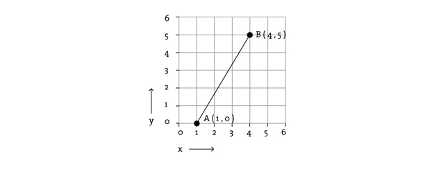
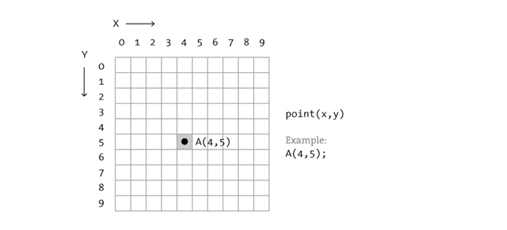
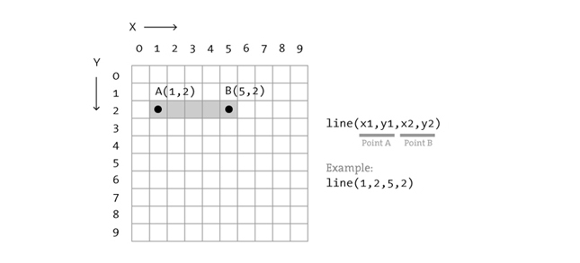
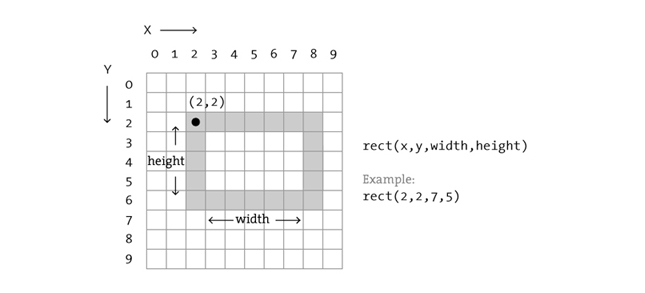
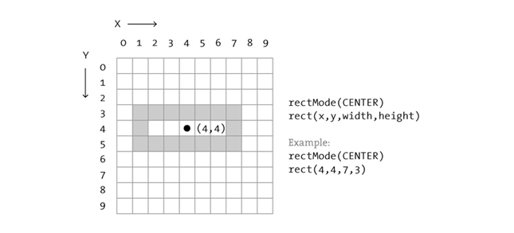
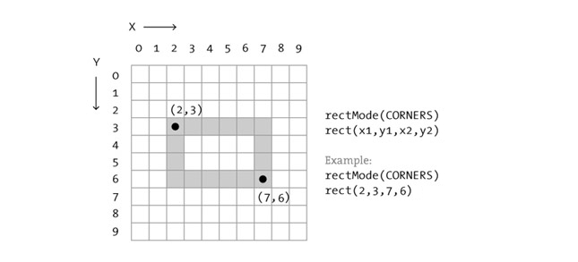
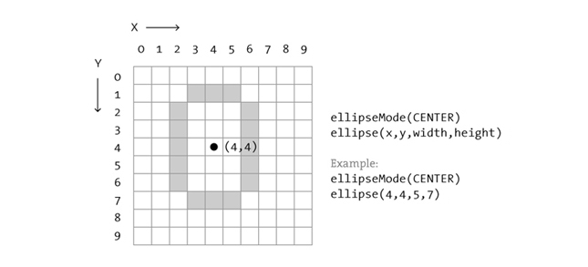
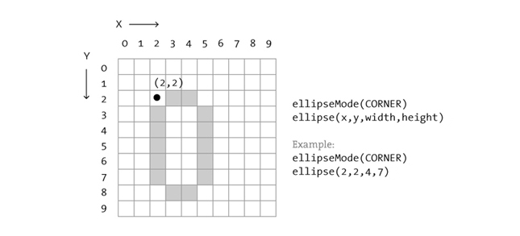
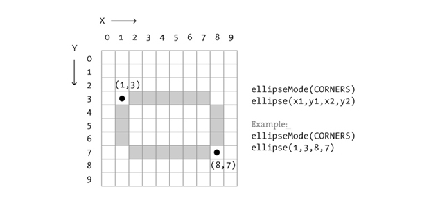
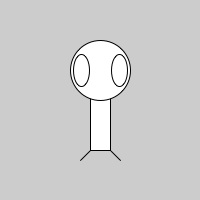

> ## 학습 목표
>
> *   수학 좌표계와 컴퓨터 좌표계를 이해한다.
> *   프로세싱 기본 모양을 이해한다.

## 좌표 공간(Cooridate Space)

프로세싱 프로그래밍을 시작하기 전에,
중학교로 되돌아가서 모눈종이를 꺼내서 선을 긋는다.
두 점사이 가장 가까운 거리는 직선이 되고, 
모눈종이에 두점에서 시작한다.

두점 A (1,0), B (4,5) 사이 직선이 그림에 나타나 있다.
만약 친구에게 똑같은 직선을 그리게 하려면, 
"0과 1에 있는 점에서 4와 5에 있는 점까지 선을 그려줘 부탁이야"라고 해야 한다.
그런데 잠시만, 친구가 컴퓨터이며 모니터 화면에 똑같은 직선을 표시하는 디지털 편지를 작성한다고 상상하자. 
동일한 명령이 적용된다.(단지 이번에는 사교적인 인사는 건너뛰고, 정확한 형식을 갖추는 것이 요구된다.) 다음에 지시명령이 나와 있다:

~~~ {.python}
line(1,0,4,5)
~~~

코드를 작성하는 구문을 공부하지 않도고, 상기 문장은 상당한 의미가 있다.
컴퓨터가 `line`으로 이름붙은 명령어를 제공하는데 `함수(function)`이라고 부른다. 추가로, 직선이 그려지는 방법(즉, 점A (1,0)에서 점B (4,5)까지)에 대한 인자도 명시하고 있다.
코드 한줄을 문장으로 생각하면, 함수는 동사, 인자는 문장의 목적에 해당된다.
코드 문장은 파이썬이 아닌 경우 마침표 대신에 세미콜론으로 끝난다.

여기서 중요한 것은 컴퓨터 화면이 다름아닌 좀더 멋진 모눈종이에 다름아니다는 것을 알아채는 것이다.
화면 각 픽셀(pixel)은 좌표로 - 두 숫자 x (가로), y (세로) - 
2차원 평면에 점 위치를 결정한다.
프로그래머의 역할은 각 픽셀 좌표에 어떤 모양과 색깔을 채울지 지정하는 것이다.

그럼에도 불구하고, 여기 함정이 있다.
중학교 모눈종이는 "직교 좌표계(데카르트 좌표계)"로 x축과 y축이 만나는 중앙을 (0,0)으로 한다. (오른쪽과 위쪽으로 양의 방향, 왼쪽과 아래쪽으로 음의 방향) 하지만, 컴퓨터 윈도우에서 픽셀에 대한 좌표계는 y축을 따라 거꾸로 된다. (0,0)이 왼쪽 상단에 위치하고, 양의 방향으로 각각 수평으로 오른쪽, 수직으로 아래쪽으로 나아간다.

## 단순한 도형

프로세싱으로 만나게 되는 매우 많은 프로그래밍 예제는 본질적으로 시각적(visual)이다. 핵심 코어(core)에 예제로 모양을 그리고 픽셀을 설정하는게 포함된다. 네가지 기초요소 모양(primitive shapes)을 살펴보면서 시작해 보자.

각 모양별로, 프로그래머에게 요구되는 정보는 해당 모양의 크기와 위치(나중에 색깔)를 지정하고, 프로세싱이 작성한 정보를 어떻게 받아갈지 배우는 것이다.
다음 다이어그램에서 폭이 10 픽셀이고 높이가 10 픽셀 윈도우를 가정한다.
특별히 현실적이지는 않는데 이유는 이유는 실제로 코딩을 시작할 때, 좀더 커다란 윈도우에서 거의 작업할 것이다. (10X10 픽셀은 화면 공간에서 겨우 몇 밀리미터에 불과하다.)
그럼에도 불구하고, 시연 목적으로는 픽셀을 표현한느데 좀더 적은 숫자로 작업하는 것이 멋지다. 
이유는 각 코드가 내부적으로 동작하는 것을 더잘 시연하는데 모눈종이처럼 보이기 때문이다.

점 `point()`는 시작하기 가장 쉬운 모양이며 출발점이다.
점을 찍기 위해서 `x`와 `y` 좌표만 필요하다.

선 `line()`도 그다지 어렵지 않은데, 단지 두 점 정보만 필요하다: `(x1, y1)`, `(x2,y2)`.

사각형 `rect()`을 그리게 되면, 다소 복잡해진다.
프로세싱에서 사각형을 그릴때, 사각형 왼쪽 상단 좌표를 지정해야 하고, 폭과 높이도 저정해야 한다.

사격형을 그리는 두번째 방법은 중심과 더불어 폭과 높이를 지정하는 것이다.
만약 이 방식을 선호한다면, 
사각형 자체에 대한 명령지침을 내리기 전에 먼저 "CENTER" 모드(mode)를 사용한다고 표기한다. 프로세싱은 대소문자 구별하는 것에 주의한다.

마지막으로, 두점으로 사각형을 또한 그릴 수도 있다.
(두점은 각각 좌측 상단과 우측하단 점이 된다.)
여기서 모드(mode)는 "CORNERS"가 된다.

사각형 그리는 개념에 편안함을 느끼게 되면, 타원 **[ellipse()](https://www.processing.org/reference/ellipse_.html)**는 간단하다.
사실 사각형 `rect()`와 동일한데 차이는 타원이 둥근 사각형을 그린다는 것만 다른다. 타원 `ellipse()` 기본설정 모드는 "CORNER"가 아니고 "CENTER"다.

상기 타원이 특별히 원처럼 보이지 않는 것을 인정하는 것이 중요하다.
프로세싱에 원 모양을 생성하는데 어떤 픽셀이 사용되어야 하는지 지정하는 방법론이 내장되있다. 상기와 같이 줌인(Zoom-in)하면, 원 같은 패턴으로된 많은 사각형이 있다. 하지만 줌아웃(Zoom-out)하면 화면에 멋진 타원으로 보인다. 또한 프로세싱에는 각 픽셀을 색으로 채우도록 자신만의 알고리즘을 개발할 수 있는 기능이 있다. (사실, 이미 "점(point"를 반복적으로 사용해서 어떻게 구현할 수 있는지 가름할 수 있다.)
하지만, 지금으로서는 타원 "ellipse" 문장으로 힘든 일을 수행한 것에 만족하자. (픽셀에 대한 좀더 자세한 정보는 [픽셀 참조 문헌 웹페이지](http://processing.org/reference/pixels.html)에서 시작한다. 하지만, 이번 튜토리얼보다 훨씬 더 고급과정이다.) 

이제, 200 X 200 윈도우를 가지고 좀더 현실적으로 모양 코드로 할 수 있는 것을 살펴보자. [size()](http://www.processing.org/reference/size_.html) 함수를 사용해서 윈도우 폭과 높이를 지정할 수 있다는 것에 주목한다.

~~~ {.python}
size(200,200)
rectMode(CENTER)
rect(100,100,20,100)
ellipse(100,70,60,60)
ellipse(81,70,16,32) 
ellipse(119,70,16,32) 
line(90,150,80,160)
line(110,150,120,160)
~~~