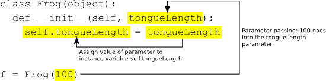

> ## 학습 목표
>
> *   

## OOP에 공감

객체지향 프로그래밍(object-oriented programming, OOP)이 어떻게 프로세싱에서 동장하는지 
구체적인 것을 살펴보기 전에, `객체(Object)` 그 자체에 대해서 짧게 개념적인 부분을 다뤄보자.
프로세싱으로 프로그래밍을 작성하지 않고, 대신에 하루동안 수행 목록으로 프로그램을 작성한다고 상상하자.
수행 목록만 자성하면 다음과 같이 시작될 것이다:

- 기상
- 커피(혹은 차) 마시기
- 아침먹기: 시리얼, 블루베리, 두유
- 지하철 타기

여기서 관여된 것은 무엇인가? 구체적으로 어떤 것이 관여되었는가?
먼저, 상기 수행목록을 어떻게 작성했는지 즉시 명확하지 않지만, 핵심은 당신, 인간, 사람이다.
여러분은 어떤 속성을 드러낸다. 여러분은 어떤 방식으로 보여진다; 아마도 여러분은 갈색 머리를 갖고, 안경을 쓰고, 
다소 샌님처럼 보인다. 여러분은 무언가 수행할 능력도 있다; 기상(추측컨데 잠도 잘수 있고)해서, 아침 먹고, 지하철을 탄다.
여러분 같은 객체는 특성을 갖고 무언가 수행할 수 있는 사물(thing)이다. 

그래서 상기 개념이 프로그래밍에 어떻게 관련이 있을까? 
객체 속성은 변수(variable)다; 그리고 객체가 수행할 수 있는 것이 함수(function)다.
객체-지향 프로그래밍(Object-oriented programming)은 모든 프로그래밍 기본 원칙의 결혼이다: **데이터(data)**와 **기능(functionality)**.

매우 간단한 사람 객체에 데이터와 기능을 매핑하자.

#### 사람 데이터

- 신장
- 체중
- 성별
- 눈 색깔
- 머리 색깔

#### 사람 기능

- 잠자기
- 일어나기
- 식사하기
- 대중교통 타기

이제 좀더 진도를 나가기 전에, 짧은 형이상학적 여담을 시작해보자.
상기 구조는 그 자체로 사람은 아니다; 단순하게 사람뒤에 숨겨진 생각 혹은 개념을 기술했다.
사람이 되려면 어떤 모습인지를 기술한 것이다. 사람이 되기 위해서는 키가 있고, 머리가 있고,
잠을 자야 하고, 먹어야 한다는 등등이 있어야 한다. 
이것이 프로그래밍 객체에 대한 중요한 차이가 된다.
이 사람 템플릿을 클래스(class)라 한다. 클래스는 객체와 다르다.
여러분은 객체다. 나도 객체다. 지하철 사람도 객체다. 아인슈타인도 객체다.
우리 모두는 사람으로, 인간이라는 생각을 구현한 현실 세계 인스턴스(instance)다. 

붕어빵 거푸집을 생각해보자. 붕어빵 틀로 붕어방을 찍어낸다. 하지만 붕어빵 틀은 그자체로 붕어빵이 아니다.
붕어방 틀이 클래스고, 붕어빵은 객체다.

## 객체 사용하기

클래스 자체로 실제 클래스를 작성하는 전에, 주 프로그램(예를 들어, **setup()**, **draw()**)에 객체를 사용하면 세상을 어떻게 더 좋은 장소로 만드는지 잠시 살펴보자.

화면을 가로질러 횡으로 사각형을 이동하는 간단한 스케치 의사코도(pseudo-code)를 생각해보자. (이 사각형을 "자동차"로 생각하자)

#### 데이터 (전역 변수)

- 자동차 색깔
- 자동차 위치 x
- 자동차 위치 y
- 자동차 속도 x
 
#### 설정 (Setup)

- 자동차 색깔 초기화
- 출발점으로 자동차 위치를 초기화
- 자동차 속도 초기화

#### 그리기 (Draw)

- 배경색을 채운다.
- 색으로 자동차 위치 표시한다.
- 속도로 자동차 위치를 증가시킨다.

상기 의사코드를 구현하기 위해서, 프로그램 상단에 전역 변수를 정의하고,
setup()에서 전역변수를 초기화하고, 함수를 호출해서 draw()에서 자동차를 이동하고 화면에 표시한다.
다음과 같다.

~~~ {.python}
c = color(0)
x = 0.0
y = 100.0
speed = 1.0

def setup():
    size(200, 200)

def draw():
    background(255)
    move()
    display()

def move():
    x = x + speed
    if x > width:
        x = 0

def display():
    fill(c)
    rect(x, y, 30, 10)
~~~

객체지향 프로그래밍은 주 프로그램에서 모든 변수와 함수를 빼내서 자동차 객체 내부에 저장한다.
자동차 객체는 데이터(색깔, 위치, 속도)에 대해서 모두 알고 있다.
또한, 객체는 객체가 할 수 있는 것, 메소드(객체 내부 함수)에 대해 알고 있다 - 자동차는 운행할 수 있고, 화면에 표시될 수 있다.

객체지향 설계를 사용하서 의사코드를 개선하면 다음과 같다:

#### 데이터 (전역 변수)

- 자동차 객체
 
#### 설정 (Setup)

- 자동차 객체 초기화

#### 그리기 (Draw)

- 배경색을 채운다.
- 자동차 객체를 표시한다.
- 자동차 객체를 운전한다.

첫번째 예제에 있던 모든 전역변수를 제거한 것에 주목한다.
자동차 색깔, 자동차 위치, 자동차 속도 별로 각 변수를 갖는 대신에,
이제는 자동차 변수 (Car vairable), 단지 한 변수만 있다.
변수 세개를 초기화하는 대신에, 사물 한개, 자동차 객체(Car object)를 초기화한다.
변수들은 모두 어디로 갔을까? 
여전히 존재하는데 이제 자동차 객체(Car object) 내부에 존재한다.
(변수는 자동차 클래스에 정의될 것이고 잠시 살펴볼 것이다.)

의사코드를 넘어, 스케치 실제 코드는 다음과 같이 보일 것이다:

~~~ {.python}
myCar = Car()

def draw():
    background(255)
    myCar.drive()
    myCar.display()
~~~

잠시 상기 코드에 관해 세부적인 사항을 다룰 것이다. 
하지만, 그렇게 하기 전에, 자동차 클래스(Car class)가 어떻게 작성되는지 살펴보자.

## 붕어빵 틀 작성하기

상기 간단한 자동차 예제를 통해서 프로세싱에서 객체를 사용하면 어떻게 깔끔하고 가독성이 높은 코드를 만들 수 있는지 시연했다.
힘든 작업은 객체 템플릿, 즉 클래스를 작성하는데 있다.
처음으로 객체지향 프로그래밍을 작성하는 것을 학습할 때, 객체없이 모든 기능을 전혀 변경하지 않고 작성된 프로그램을 살펴보는 것이 종종 유용한 실습이 된다.
정확하게 자동차 예제를 가지고 실습을 진행한다. 즉, 객체지향 방식으로 정확하게 같은 외양과 행동을 다시 생성한다.

모든 클래스는 요소를 4개 갖는다: 이름, 데이터, 초기화(생성자), 그리고 메쏘드다.
(기술적으로 실제 필요한 단 하나 요소는 클래스 이름이다. 하지만, 객체지향 프로그램을 하는 핵심은 모든 요소를 포함하는데 있다.)

다음에 간단한 객체지향이 아닌 스케치에서 모든 요소를 뽑아서 자동차 클래스(Car class)에 위치시키는 방법이 있다.
그러고 나면, 자동차 클래스에서 자동차 객체(Car objects)를 찍어낼 수 있다.

<table width="656">
    <tr>
      <td></td>
    </tr>

    <tr>
      <td class="obj_pre">
        <pre># Simple non-OOP car</pre>
      </td>

      <td>&#8594;</td>

      <td class="obj_post">
        <pre>class Car(object):</pre>
      </td>

      <td>&#8594;</td>

      <td class="obj_desc">The class name</td>
    </tr>

    <tr>
      <td class="obj_pre obj_yellow">
        <pre>
c = color(255)
xpos = 100
ypos = 100
xspeed = 1
</pre>
      </td>

      <td>&#8594;</td>

      <td class="obj_post obj_yellow">
        <pre>
def __init__(self):
    self.c = color(255)
    self.xpos = 100
    self.ypos = 100
    self.xspeed = 1
</pre>
      </td>

      <td>&#8594;</td>

      <td class="obj_desc">Initializing data</td>
    </tr>

    <tr>
      <td class="obj_pre">
        <pre>
def setup():
    size(200, 200)

def draw():
    background(0)
    display()
    drive()

</pre>
      </td>

      <td></td>

      <td class="obj_post"></td>

      <td></td>

      <td class="obj_desc"></td>
    </tr>

    <tr>
      <td class="obj_pre obj_yellow">
        <pre>
def display():
    rectMode(CENTER)
    fill(c)
    rect(xpos, ypos, 20, 10)

def drive():
    xpos = xpos + xspeed
    if xpos &gt; width:
    xpos = 0
</pre>
      </td>

      <td>&#8594;</td>

      <td class="obj_post obj_yellow">
        <pre>
def display(self):
    rectMode(CENTER)
    fill(self.c)
    rect(self.xpos, self.ypos, 20, 10)

def drive(self):
    self.xpos = self.xspeed
    if self.xpos &gt; width:
        self.xpos = 0
</pre>
      </td>

      <td>&#8594;</td>

      <td class="obj_desc">Functionality</td>
    </tr>
</table>

**클래스 이름(Class Name)** 클래스 이름은 `class WhateverNameYouChoose(object)`에서 명시된다.
그리고 나면 들여쓰기 블록에 모든 코드를 감싸넣는다.
전통적으로 클래스 이름은 대문자로 시작한다. 이유는 전통적으로 소문자인 변수이름과 구별하기 위해서다.

**데이터 초기화(Data initialization)** 클래스에서 객체를 생성할 때마다, 
파이썬이 자동적으로 `__init__` 메쏘드를 호출한다.
클래스에 초기화 메쏘드를 정의해야하고 여기에 데이터를 초기화한다.
메쏘드 내부에 코드를 작성할 때, `self`라는 특수 단어가 있는데 클래스 각 인스턴스에 정의된 변수를 설정하게 한다.
이런 방식으로 정의된 변수를 종종 "인스턴스 변수(instance variable)"로 불린다.
(`__init__` 메쏘드는 자바나 C++ 같은 객체지향 언어에서 "생성자(constructor)"와 유사하다.)

**기능(Functionality)** 메쏘드를 작성해서 객체에 기능을 추가할 수 있다.
모든 메쏘드 (`__init__`를 포함해서) 첫 매개변수는 `self`여야 한다.
메쏘드를 호출할 때, 파이썬이 자동적으로 이 매개변수를 메쏘드에 전달한다;
이것을 통해서 매쏘드 내부에서 각 객체 인스턴스 변수에 접근할 수 있다.

사용하기 전에 정의되기만 하면, 클래스 코드는 자신 블록으로 존재하고,
 `setup()`과 `draw()` 밖 어디에도 위치시킬 수 있음을 주목한다.

 ## 객체 사용하기: 세부사항

 앞에서, 객체가 프로세싱 스케치 주요 부분을 매우 간략화할 수 있는 것을 살짝 엿봤다. 
 (예를 들어, **setup()**, **draw()**)

~~~ {.python}
# Step 1. Instantiate the object.
myCar = Car()

def setup():
    size(200, 200)

def draw():
    background(255)
    # Step 2. Call methods on the object. 
    myCar.drive()   
    myCar.display()
~~~

상기 각 단계별로 숨겨진 세부사항을 살펴보자.
스케치에서 객체를 사용하는 방법을 개괄적으로 보여준다.

** 1 단계. 객체 변수를 초기화한다.**

변수를 초기화하기 위해서(즉, 초기값을 부여), 대입 연산(assignment operation)을 사용한다.(변수는 무엇과 같다)
파이썬 자료형으로 다음과 같다.

~~~ {.python}
# 변수 초기화 (Variable Initialization)   
var = 10   # 변수 var는 10과 같다 (var equals 10)  
~~~

객체를 초기화하는 것은 약간더 복잡하다.
단순히 정수 혹은 실수같은 값을 대입하는 대신에, 객체를 초기화해야 한다.
함수처럼 클래스 이름을 호출해서 초기화한다.

~~~ {.python}
# 객체 초기화 (Object Initialization)   
myCar = Car()
~~~

상기 예제에서 "myCar"는 객체 변수 이름이고 "="은 변수에 무언가 동일한 것을 설정하는데,
그 무언가는 새로운 Car 객체 인스턴스다.
여기서 정말 수행하는 것은 자동차 객체 (Car object)를 초기화하는 것이다.
정수 같은 기초요소 변수(primitive variable)를 초기화할 때, 단지 변수를 숫자와 같게 설정한다.
하지만 객체는 다수 데이터 조각으로 구성되어 있다.
자동차 클래스(Car class)를 상기하면, 해당 코드 줄이 `__init__` 메쏘드를 호출하는 것을 본다.
`__init__` 메쏘드는 특수 메쏘드로 모든 객체 변수를 초기화하고, 
자동차 객체(Car object)를 바로 사용할 수 있게 확실히 한다.

** 2 단계. 객체 사용하기**

성공적으로 객체를 인스턴스화하고 나면, 객체를 사용할 수 있다.
객체를 사용한다는 의미에는 객체에 내장된 메쏘드 호출을 포함한다.
사람 객체는 음식을 먹고, 자동차 객체는  운전할 수 있고, 강아지는 짖을 수 있다.
객체 내부에 함수 호출은 점 구문 표기법(dot syntax)을 통해서 구현할 수 있다: 
변수명.객체함수(함수 인자), variableName.objectFunction(Function Arguments).

자동차 경우에, 이용가능한 함수가 어는 것도 인자를 갖지 않는다. 그래서 다음과 같다:

~~~ {.python}
# "점 구문 표기법"으로 함수를 호출한다.
myCar.drive()
myCar.display()
~~~

## `__init__` 메쏘드에 인자

상기 예제에서 자동차 객체는(Car object)는 다음과 같이 초기화된다:

~~~ {.python}
myCar = Car()
~~~

객체지향 프로그래밍 기초를 배웠지만, 상기 표현식은 유용한 단순화다.
그럼에도 불구하고, 상기 코드는 다소 심각한 문제를 안고 있다.
만약 자동차 객체 두개를 갖는 프로그램을 작성한다면 어떨까?

~~~ {.python}
# 자동차 객체 두개 생성하기
myCar1 = Car()
myCar2 = Car()
~~~

상기 코드는 원하는 바를 달성한다: 코드를 통해서 자동차 객체 두대를 생산했다,
한대는 `myCar1`에 다른 한대는 `myCar2`에 저장되었다.
하지만, 자동차 클래스(Car class)를 살펴보면, 두 자동차는 동일하다는 것을 알게된다:
각 자동차는 하얀색이고, 화면 중간에 있고, 속도는 1을 갖는다. 
말로 표현하면 상기는 코드는 다음과 같다.

**새 자동차를 만들어라**

대신에 다음과 같이 말하고 싶다.

**빨간색, (0,10) 위치에 속도는 1인 새로운 자동차를 만들어라.**

그렇다면 또한 다음과 같이 말할 수도 있다.

**파란색, (0,100) 위치에 속도는 2인 새로운 자동차를 만들어라.**

상기 요구사항을 괄호 안쪽에 인자를 넣어서 달성할 수 있다.

~~~ {.python}
myCar = Car(color(255,0,0), 0, 100, 2)
~~~

`__init__` 메쏘드를 다시 작성해서 상기 인자를 담아낸다.

~~~ {.python}
def __init__(self, c, xpos, ypos, xspeed):
    self.c = c   
    self.xpos = xpos
    self.ypos = ypos
    self.xspeed = xspeed
~~~

저자 경험으로 `__init__` 메쏘드에 인잘르 사용해서 객체 변수를 초기화하는 것은 다소 혼란스러울 수 있다.
자신을 책망하지는 마세요. 코드가 이상해 보이고, 몹시 중복된 것처럼 보이다: "모든 단일 변수마다,
`__init__` 메쏘드에 인자를 추가해야 하나?"

그럼에도 불구하고, 이것은 중요한 기술로 배워야 되고, 궁긍적으로 객체지향 프로그래밍르 강력하게 만드는 요인중 하나다.
하지만, 지금 고통스럽게 느껴질 수 있다. 
이런 맥락에서 매개변수가 어떻게 동작하는지 살펴보자.

매개변수는 함수 몸통부분(body) 내부에서 사용되는 지역변수(local variable)로 함수가 호출될 때 값으로 채워진다.
상기 예제에서, 한가지 목적만 가지는데 객체 내부에 변수를 초기화한다.
자동차 실제 색깔, 자동차 실제 위치 x, 등을 변수가 나타낸다.
`__init__` 메쏘드 인자는 단지 일시적으로, 객체가 만들어지는 값을 객체 자신에게 전달하기 위해서 존재한다.
물론, 함수 매개변수를 원하는 아무거나 이름을 지을 수 있다. 인스터스 변수와 동일한 이름을 가질 필요는 없다.
하지만, 유의미하고 일관성 갖는 이름으로 지을 것을 추천한다.

이제 유일한 특성을 갖는 다수 객체 인스턴스를 동일한 스케치 위에 올려놓고 살펴보자.

~~~ {.python}
# 객체가 다수 있지만, 여전히 클래스는 하나만 필요하다.
# 아무리 많은 붕어빵을 만들더라도, 단지 붕어빵 틀은 하나만 필요하다.
class Car(object):
    # The Constructor is defined with arguments.
    def __init__(self, c, xpos, ypos, xspeed):
        self.c = c
        self.xpos = xpos
        self.ypos = ypos
        self.xspeed = xspeed
    
    def display(self):
        stroke(0)
        fill(self.c)
        rectMode(CENTER)
        rect(self.xpos, self.ypos, 20, 10);
    
    def drive(self):
        self.xpos = self.xpos + self.xspeed;
        if self.xpos > width:
            self.xpos = 0

myCar1 = Car(color(255, 0, 0), 0, 100, 2)
myCar2 = Car(color(0, 255, 255), 0, 10, 1)

def setup():
    size(200,200)

def draw(): 
    background(255)
    myCar1.drive()
    myCar1.display()
    myCar2.drive()
    myCar2.display()
~~~

## 객체도 또한 자료형이다!

이것이 첫 객체지향 프로그래밍 경험이라고 가정하면, 쉬엄쉬엄 침착하는 것이 중요하다.
여기 예제에서 단지 클래스 한개, 그 클래스에서 2개 혹은 3개 객체를 생성했다.
그럼에도 불구하고, 사실 객체를 뽑아내는데는 제한이 없다.
프로세싱 스케치에 작문하는 것처럼 가능한 많은 클래스를 담을 수 있다.

만약 추억의 겔로그(Space Invaders) 게임을 프로그래밍한다면, 
예를 들어, 게임에 각 개체(entity, 엔티티)로 객체를 사용해서 
우주선 클래스(Sapceship class), 적군 클래스(Enemy class), 총알 클래스(Buleet class) 생성할 수도 있다.

추가로, 기초요소 자료형(primitive)은 아니지만, 클래스는 정수나 실수 같은 자료형(data type)이다.
클래스는 데이터로 구성되기 때문에, 객체는 다른 객체를 포함할 수 있다.
예를 들어, 방금 포크(Fork)와 숟가락(Spoon) 클래스 프로그래밍을 끝마쳤다고 가정하자.
상차림(PlaceSetting) 클래스로 옮겨와서, 클래스 내부에 포크 객체와 숟가락 객체를 변수로 포함한다.
완벽하게 합리적이고, 객체지향 프로그래밍에서 매우 흔하다.

~~~ {.python}
class PlaceSetting(object):
    def __init__(self):
        fork = Fork()
        spoon = Spoon()
~~~

다른 어떤 자료형과 마찬가지로 객체를 함수에 인자로 넘길 수도 있다.
겔로그 게임 예제에서, 만약 우주선이 총알을 적군에게 쏘면,
아마도 적군이 총알에 맞았는지 판단하기 위해서 적군 클래스 내부에 함수를 작성할 것이다.

~~~ {.python}
def hit(self, bullet):
    bulletX = bullet.getX()
    bulletY = bullet.getY()
    # Code to determine if   
    # the bullet struck the enemy 
~~~

기초요소 값(정수, 실수 등)이 함수에 전달될 때, 
복사가 된다. 객체에 대해서는 경우가 다르다. 
결과가 좀더 직관적이다.
함수에 객체가 전달된 뒤에 변경사항이 발생하면,
스케치에 어딘가 사용된 객체에도 변경사항이 영향을 미친다.
이것은 **참조에 의한 전달(pass-by-reference)**로 알려져 있는데,
이유는 복사 대신에 실제 객체 참조가 함수에 전달되기 때문이다.
